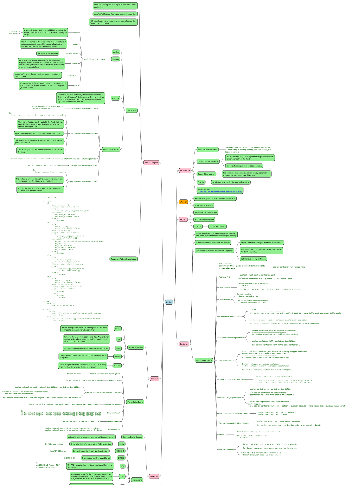

# DOCKER

```plantuml
@startmindmap
<style>
mindmapDiagram {
  node {
    BackgroundColor lightGreen
    MaximumWidth 400
  }
  boxless {
    FontColor darkgreen
  }
}
</style>
*[#lightblue] Docker
**[#FFBBCC] Architecture
*** client-server architecture
****_ The Docker client talks to the Docker daemon, which does the heavy lifting of building, running, and distributing your Docker containers
*** Docker Daemon (dockerd)
**** Is a process that keeps running in the background and waits for commands from the client.
**** Capable of managing various Docker objects.
*** Docker Client (docker)
**** Is a command-line interface program mostly responsible for transporting commands issued by users.
*** Rest Api
**** As a bridge between the daemon and the client
*** The Full Picture [[https://docs.docker.com/engine/images/architecture.svg]]

**[#Orange] What is?
*** A container Engine built on top of linux namespaces
*** Is not a Vitual Machine!

**[#FFBBCC] Registry
*** Allows push & pull of images
*** Is a repository of images
*** Example
**** Docker Hub : mylink

**[#FFBBCC] Container
*** Instead of virtualizing the entire physical machine, containers virtualize the host operating system only
*** Is an instance of an Image with parameters
*** Syntax: docker <object> <command> <options>
**** object: "container", "image", "network" or "volume" ...
**** command: "run", "ls", "rename", "stop", "kill", "start", "restart", "create" ...
**** options: --publish, --all, --detach, ...

*** Manipulation Basics 
****_:Run a Container: 
combination of two separate commands **container create** and **container start** 
;
*****_:
<code>
  docker container run <image name>
</code>
;
****_ Publish a Port
*****_:
<code>
  --publish <host port>:<container port>
  ----------------------------------
  Ex: docker container run --publish 8080:80 hello-world
</code>
;
****_ Detached Mode
*****_:Keep a container running in background
<code>
  --detach
  ----------------------------------
  Ex: docker container run --detach --publish 8080:80 hello-world
</code>
;
****_ List Containers
*****_:Currently running
<code>
  docker container ls
</code>
;
*****_: The containers that have run in the past 
<code>
    docker container ls --all
</code>
;
****_ Name or Rename a Container
*****_:
<code>
  --name
  ----------------------------------
  Ex: docker container run --detach --publish 8888:80 --name hello-dock-container hello-world
</code>
;
*****_:
<code>
  docker container rename <container identifier> <new name>
  ----------------------------------
  Ex: docker container rename hello-dock-container hello-dock-container-2
</code>
;
****_ Stop or Kill a Running Container
*****_:
<code>
  docker container stop <container identifier>
  ----------------------------------
  Ex: docker container stop hello-dock-container
</code>
;
*****_:
<code>
  docker container kill <container identifier>
  ----------------------------------
  Ex: docker container kill hello-dock-container-2
</code>
;
****_ Restart a Container
*****_:
<code>
- Start: the start command just starts an already stopped container.
  docker container start <container identifier>
  ----------------------------------
  Ex: docker container start hello-dock-container
</code>
;
*****_:
<code>
- Restart: stopped or running container
  docker container restart <container identifier>
  ----------------------------------
  Ex: docker container restart hello-dock-container-2
</code>
;
****_ Create a Container Without Running
*****_:
<code>
  docker container create <image name>
  ----------------------------------
  Ex: docker container create --publish 8080:80 hello-world
  (it won't be listed without the use of the --all option.)
</code>
;
****_ Remove Dangling Containers
*****_:
<code>
  docker container rm <container identifier>
  ----------------------------------
  Ex: docker container rm 6cf52771dde1
  (container ls --all find status **Exited**.)
</code>
;
*****_: 
- Remove after stop: the containers removed as soon as they're stopped.
<code>
  Ex: docker container run --rm --detach --publish 8888:80 --name hello-dock-volatile hello-world
</code>
;
****_ Run a Container in Interactive Mode (-it)
*****_:
<code>
  docker container run --rm -it ubuntu
  docker container run -it node
</code>
;
****_ Execute Commands Inside a Container
*****_:
<code>
  docker container run <image name> <command>
  ----------------------------------
  Ex: docker container run --rm busybox echo -n my-secret | base64
</code>
;
****_ Access Logs
*****_:
<code>
  docker container logs <container identifier>
  ----------------------------------
  get a continuous stream of text
  --follow or -f
</code>
;
****_ Execute Commands
*****_:
<code>
  docker container exec <container identifier> <command>
  ----------------------------------
  Ex: docker container exec notes-api npm run db:migrate
</code>
;
*****_: run an interactive command inside a running container
<code>
  docker container exec -it notes-api sh
</code>
;


left side

**[#FFBBCC] Docker-Compose
*** a tool for defining and running multi-container Docker applications
*** use a YAML file to configure your application’s services
*** with a single command, you create and start all the services from your configuration
*** Instructions
**** version
**** services
*****_ block defines a new service 
******_ build
******* a pre-built image, Under the build block we define the context and the name of the Dockerfile for building an image
********_ context
********_ dockerfile

******_ image
******* The image key holds the name of the image to be built. If not assigned, the image will be named following the <project directory name>_<service name> syntax.
******_ container_name
******* the name of the container
******_ volumes 
******* array holds the volume mappings for the service and supports named volumes, anonymous volumes, and bind mounts. The syntax <source>:<destination> is identical to what you've seen before.
******_ environment
******* you can refer to another service in the same application by using its name
******_ ports
******* The ports map defines any port mapping. The syntax, <host port>:<container port> is identical to the --publish option you used before.
**** volumes
***** Any named volume used in any of the services has to be defined here. If you don't define a name, the volume will be named following the <project directory name>_<volume key> and the key here is db-data.

**** Manipulation Basics
*****_ List Services in Docker Compose
******_:Listing containers defined in the YAML only
<code>
  docker-compose ps
</code>
;
*****_ Start Services in Docker Compose
******_: Ex:
<code>
  docker-compose --file docker-compose.yaml up --detach
</code>
;
****** The --file or -f option is only needed if the YAML file is not named docker-compose.yaml (but I've used here for demonstration purposes)
****** Apart from the the up command there is the start command.
****** The --detach or -d option here functions the same as the one you've seen before
****** The --build option for the up command forces a rebuild of the images
*****_ Execute Commands Inside a Running Service
******_:
<code>
  docker-compose exec <service name> <command>
</code>
;
*****_ Access Logs from a Running Service
******_:
<code>
  docker-compose logs <service name>
</code>
;
*****_ Stop Services in Docker Compose
******_: Ex:
<code>
  docker-compose down --volumes
</code>
;
****** The --volumes option indicates that you want to remove any named volume(s) defined in the volumes block. 
****** Another use stop command. It stops all the containers for the application and keeps them.

*** Compose a Full-stack Application
****_:
<code>
  version: "3.8"

  services: 
      db:
          image: postgres:12
          container_name: notes-db-dev
          volumes: 
              - db-data:/var/lib/postgresql/data
          environment:
              POSTGRES_DB: notesdb
              POSTGRES_PASSWORD: secret
          networks:
              - backend
      api:
          build: 
              context: ./api
              dockerfile: Dockerfile.dev
          image: notes-api:dev
          container_name: notes-api-dev
          volumes: 
              - /home/node/app/node_modules
              - ./api:/home/node/app
          environment: 
              DB_HOST: db ## same as the database service name
              DB_PORT: 5432
              DB_USER: postgres
              DB_DATABASE: notesdb
              DB_PASSWORD: secret
          networks:
              - backend
      client:
          build:
              context: ./client
              dockerfile: Dockerfile.dev
          image: notes-client:dev
          container_name: notes-client-dev
          volumes: 
              - /home/node/app/node_modules
              - ./client:/home/node/app
          networks:
              - frontend
      nginx:
          build:
              context: ./nginx
              dockerfile: Dockerfile.dev
          image: notes-router:dev
          container_name: notes-router-dev
          restart: unless-stopped
          ports: 
              - 8080:80
          networks:
              - backend
              - frontend

  volumes:
      db-data:
          name: notes-db-dev-data

  networks: 
      frontend:
          name: fullstack-notes-application-network-frontend
          driver: bridge
      backend:
          name: fullstack-notes-application-network-backend
          driver: bridge
</code>
;


**[#FFBBCC] Network
*** Networking Driver
**** bridge
***** Default. Multiple containers are running in standard mode and need to communicate with each other
**** host
***** Removes the network isolation completely. Any container running under a host network is basically attached to the network of the host system
**** none
***** This driver disables networking for containers altogether
**** overlay
***** This is used for connecting multiple Docker daemons across computers
**** macvlan
***** Allows assignment of MAC addresses to containers, making them function like physical devices in a network
*** Manipulation Basics
****_ To list out the networks in your system
*****_: 
<code>
  docker network ls
</code>
;
****_ Network create
*****_: 
<code>
  docker network create <network name>
</code>
;
****_ Attach a Container to a Network in Docker
*****_: 
<code>
  docker network connect <network identifier> <container identifier>
</code>
;
*****_: option for the container run or container create commands
<code>
  --network <network identifier>
  ----------------------------------
  Ex: docker container run --network skynet --rm --name alpine-box -it alpine sh
</code>
;
****_ Network disconnect
*****_: 
<code>
  docker network disconnect <network identifier> <container identifier>
</code>
;
****_ Network inspect
*****_: 
<code>
  Ex:
  docker network inspect --format='{{range .Containers}} {{.Name}} {{end}}' skynet
  docker network inspect --format='{{range .Containers}} {{.Name}} {{end}}' bridge
</code>
;
****_ Network remove
*****_: 
<code>
  docker network rm <network identifier>
</code>
;
****_ Network prune
*****_: 
<code>
  docker network prune -f or docker network prune --force
  docker network prune -a or docker network prune -f--force
</code>
;

**[#FFBBCC] Dockerfile
*** Optimize Docker Images
**** uninstall the other packages once the build process is done
*** Instructions
**** FROM
***** Every valid Dockerfile starts with a FROM instruction
******_ Ex: FROM ubuntu:latest
**** WORKDIR
***** Instruction sets the default working directory
******_ Ex: WORKDIR /zone
**** EXPOSE
***** The port that needs to be published
******_ Ex: EXPOSE 80
**** ARG
***** The ARG instruction lets you declare variables like in other languages
******_: Ex: 
  ARG FILENAME="nginx-1.19.2"
  ARG EXTENSION="tar.gz"
;
**** COPY
***** The generic syntax for the COPY instruction is COPY <source> <destination> where source is in your local filesystem and the destination is inside your image.
**** ADD
***** In the ADD instruction, I've formed the download URL dynamically using the arguments declared above
******_ Ex: ADD https://nginx.org/download/${FILENAME}.${EXTENSION}
**** RUN
***** The RUN instruction in a Dockerfile executes a command inside the container shell
******_ Ex: RUN apt-get update && \
    apt-get install nginx -y && \
    apt-get clean && rm -rf /var/lib/apt/lists/*
**** ENTRYPOINT
***** allows you to configure a container that will run as an executable.
******_ ENTRYPOINT ["executable", "param1", "param2"]
**** CMD
***** The CMD instruction sets the default command for your image
******_ Ex: CMD ["nginx", "-g", "daemon off;"]

**[#FFBBCC] Image
*** As the template for creating containers
*** Name of the image (NAMESPACE/IMAGE:TAG)
**** Namespace
***** The registry/repository of images
**** Image
***** The name of the image
**** Tag
***** Version
*** Create a Docker Image - We build an image from a Dockerfile

*** Manipulation Basics
****_ Create a Docker Image - We build an image from a Dockerfile
*****_:
<code>
  docker image build
</code>
;
****_ Tag Docker Images
*****_:
<code>
  --tag <image repository>:<image tag>
  ------------------------------------
  Ex: docker image build --tag custom-nginx:packaged
</code>
;
****_ Change Tag Docker Images
*****_:
<code>
  docker image tag <image id> <image repository>:<image tag>
  docker image tag <image repository>:<image tag> <new image repository>:<new image tag>
</code>
;
****_ List and Remove Docker Images
*****_:
<code>
  docker image ls
  docker image rm <image identifier>
</code>
;
****_ Cleanup all un-tagged dangling images 
*****_:
<code>
  docker image prune --force
  docker image prune --all
  *The --force or -f option skips any confirmation questions
  *The --all or -a option to remove all cached images in your local registry
</code>
;
****_ Layers of an image
*****_:
<code>
  docker image history <image identifier>
</code>
;

@endmindmap
```
